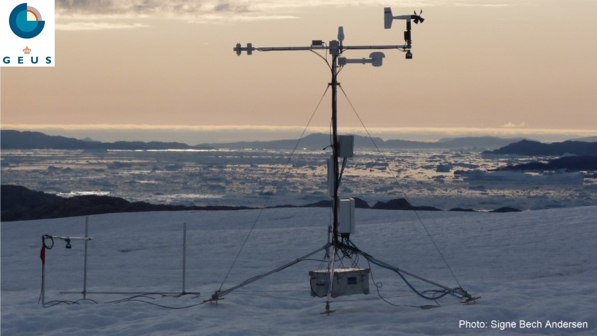

# PROMICE-AWS-toolbox

Processing toolbox for PROMICE Automatic Weather Station (AWS) data, and much more.

This repository contains Python functions for quality check, filtering and adjustment of AWS data. They rely on pandas DataFrames and require a physical copy of the PROMICE data (available here: www.promice.dk).

All functions are located in the script [PROMICE_lib.py](PROMICE_lib.py) and an exemple of how to use them is given in [main,py](main.py).

1. [Pressure transducer processing](#pressure-transducer-processing)
2. [Snow height processing](#snow-height-processing)
3. [Combining ice and snow height](#combining-ice-and-snow-height)
4. [Output PROMICE_L2 file](#Output-PROMICE_L2-file)

# Pressure transducer processing

Processing, filtering and exclusion of ice ablation time series acquired at PROMICE automatic weather stations (www.promice.dk). 

The [dpt_proc](https://github.com/BaptisteVandecrux/PROMICE-AWS-toolbox/blob/d98ce0fb3c2ed2a9000d7986299a7306c89e83e2/PROMICE_lib.py#L204) function allows to:

## 1. Adjust pressure transducer on specific days
This is done with the file [pres_trans_adj.csv](metadata/pres_trans_adj.csv) which has a simple structure:
```
site, year, adjust_start, adjust_val
NUK_U, 2010, 204, -2.6
...
```
Here at NUK_U, in 2010 on day of the year 204, the pressure transducer depth will be decreased by 2.6m. Add lines to that file to add adjustments.

## 2. Filter data
At the moment there are three filters applied on the pressure transducer depth:
- one hampel filter on the entire record
- a stricter hampel filter for doy<140
- a gradient filter where depth is not allowed to decrease more than a certain threshold within a timestep

## 3. Manually discard data during user-defined periods
This is done with the file [pres_trans_err.csv](metadata/pres_trans_err.csv) which has a simple structure:
```
site, year, err_start, err_end
UPE_U, 2019, 250, 260
...
```
Here at UPE_U, in 2019, the pressure transducer data between day of the year 250 and 260 will be discarded. Add lines to that file if needed.

## Running the pressure transducer processing

```python
	import PROMICE_lib as pl
    path_to_PROMICE='path_to_PROMICE'
    site = 'KAN_L'
    df, site =pl.load_data(file=path_to_PROMICE+site+'_hour_v03.txt', year='all')
    
    # processing pressure transducer
    df = pl.dpt_proc(df, year='all', site =site, visualisation=True)
```
## Output from the pressure transducer processing tool

ptd.DPT_processing gives as output a panda dataframe containing all the columns from the original PROMICE files plus the following columns:

**DepthPressureTransducer_Cor_adj(m)** that contains the adjusted and filtered data

**FlagPressureTransducer** that contains a quality flag informing about the data:
```
0 = original data available
1 = no data available    
2 = data available but removed manually
3 = data removed by filter
4 = interpolated
```

# Snow height processing


Processing, filtering and exclusion of the snow height time series acquired at PROMICE automatic weather stations (www.promice.dk). The height of the station boom and the height of a stake assembly above the surface are being measured by SR50 sonic rangers. These data can be used to determine the height of the snow present at the AWS.

The [hs_proc](https://github.com/BaptisteVandecrux/PROMICE-AWS-toolbox/blob/d98ce0fb3c2ed2a9000d7986299a7306c89e83e2/PROMICE_lib.py#L394) function allows to:

## 1. Adjust pressure transducer on specific days
This is done with the file [hs_adj.csv](metadata/hs_adj.csv) which has a simple structure:
```
site, instr, year, adjust_start, adjust_val
NUK_U, 1, 2010, 204, -2.6
...
```
Here at NUK_U, on instrument 1 (SR50 on weather station, 2 is for stake assembly), in 2010 on day of the year 204, the snow height will be decreased by 2.6m. Add lines to that file to add adjustments.

## 2. Filter data
At the moment there are three filters applied on the pressure transducer depth:
- one hampel filter on the entire record
- a stricter hampel filter for doy<140
- a gradient filter where depth is not allowed to decrease more than a certain threshold within a timestep

## 3. Manually discard data during user-defined periods
*Under construction*

This is done with the file [hs_err.csv](metadata/hs_err.csv) which has a simple structure:
```
site, instr, year, err_start, err_end
UPE_U, 1, 2019, 250, 260
...
```
Here at UPE_U, on instrument 1 (SR50 on weather station, 2 is for stake assembly), in 2019, the snow height data between day of the year 250 and 260 will be discarded. Add lines to that file if needed.

## Running

```python
	import PROMICE_lib as pl
    path_to_PROMICE='path_to_PROMICE'
    site = 'KPC_U'
    df, site =pl.load_data(file=path_to_PROMICE+site+'_hour_v03.txt', year='all')
      
    # processing snow height
    df = pl.hs_proc(df,site, visualisation=True)
```
## Output

[hs_proc](https://github.com/BaptisteVandecrux/PROMICE-AWS-toolbox/blob/d98ce0fb3c2ed2a9000d7986299a7306c89e83e2/PROMICE_lib.py#L394) gives as output a panda dataframe containing all the columns from the original PROMICE files plus the following columns:

**SnowHeight1_adj(m)** that contains the adjusted and filtered snow height data derived from the SR50 mounted on the station. Note that:
    
+ When the station is standing on melting ice, **SnowHeight1_adj(m)** will remain at 0.
+ The sonic ranger is installed ~2.6 m above the ice surface. It is not possible to measure snow height above that value.

**SnowHeight2_adj(m)** that contains the adjusted and filtered snow height data derived from the SR50 mounted on the stake assembly. Note that:
+ During intense melting, the stake assembly can bend and move.
+ The sonic ranger is installed at a site-specific height above the ice surface. It is not possible to measure snow height above the installation height.
+ The stake assembly is anchored several meters into the ice. So when snow is melted away and ice start to melt, **SnowHeight2_adj(m)** will give negative, decreasing height values.

*Under development:
**SnowHeight2_adj(m)** that contains a quality flag informing about the data:*
```
0 = original data available
1 = no data available    
2 = data available but removed manually
3 = data removed by filter
4 = interpolated
```

# Combining ice and snow height


The pressure transducer tracks the ice surface, the sonic ranger ranger on the station tracks the snow height is bounded to 0 when the AWS is lying on bare ice and the sonic ranger on the stake assembly can track both snow and ice surface through time, but suffers from the movement/bending of the stake assembly. We here combine the three dataset to recreate the snow and ice surface.


## Adjustments
The [combine_hs_dpt](https://github.com/BaptisteVandecrux/PROMICE-AWS-toolbox/blob/d98ce0fb3c2ed2a9000d7986299a7306c89e83e2/PROMICE_lib.py#L482) function addresses the following issues:
- In the previous step, depth of pressure transducer is reset to 0 every 1st of January. Adjust the ice surface measured by the pressure transducer so that it has a continuous value from year to year. 
- The sonic ranger installed on the AWS gives 0 height if the station is lying on bare ice, even if that ice is melting. We re-adjust the surface height derived from this sonic ranger every September so that snow buids up on top of the bare ice.
- The sonic ranger installed on the stake assemlby is adjusted each year so that the September-October values match with the sonic ranger installed on the AWS.


## Running

To combine the pressure transducer and snow height data, you need to process these two variables first, and the use [combine_hs_dpt](https://github.com/BaptisteVandecrux/PROMICE-AWS-toolbox/blob/d98ce0fb3c2ed2a9000d7986299a7306c89e83e2/PROMICE_lib.py#L482):

```python
	import PROMICE_lib as pl
    path_to_PROMICE='path_to_PROMICE'
    site = 'QAS_U'
    df, site =pl.load_data(file=path_to_PROMICE+site+'_hour_v03.txt', year='all')
    
    # processing pressure transducer
    df = pl.dpt_proc(df, year='all', site =site, visualisation=True)
    
    if len(df) > 0:    
        # processing snow height
        df = pl.hs_proc(df,site, visualisation=True)
         # combining pressure transducer and surface height to reconstruct the surface heigh
        df = pl.combine_hs_dpt(df, site)
```

## Output

[combine_hs_dpt](https://github.com/BaptisteVandecrux/PROMICE-AWS-toolbox/blob/d98ce0fb3c2ed2a9000d7986299a7306c89e83e2/PROMICE_lib.py#L482) gives as output a panda dataframe containing all the columns from the original PROMICE files plus the following columns:

**DepthPressureTransducer_Cor_adj(m)** that contains the adjusted, filtered and year-to-year continuous pressure transducer data.

**SurfaceHeight1_adj(m)** that contains the adjusted and filtered surface height derived from the sonic ranger installed on the AWS.

**SurfaceHeight2_adj(m)** that contains the adjusted and filtered surface height derived from the sonic ranger installed on the stake assembly.

*Under development
**FlagSurfaceHeight** that contains a quality flag informing about the data:
```
0 = original data available
1 = no data available    
2 = data available but removed manually
3 = data removed by filter
4 = interpolated
```

# Output PROMICE_L2 file

This is easily done outputing the pandas dataframe to tab-delimited text file:

```python
    import PROMICE_lib as pl
    path_to_PROMICE='path_to_PROMICE'
    site = 'QAS_U'
    df, site =pl.load_data(file=path_to_PROMICE+site+'_hour_v03.txt', year='all')
    
    # processing pressure transducer
    df = pl.dpt_proc(df, year='all', site =site, visualisation=True)
    
    if len(df) > 0:    
        # processing snow height
        df = pl.hs_proc(df,site, visualisation=True)
         # combining pressure transducer and surface height to reconstruct the surface heigh
        df = pl.combine_hs_dpt(df, site)
        
        # saving to file
        if len(df)>0:
            df.fillna(-999).to_csv(site+'_hour_v03_L2.txt', sep="\t")
```


