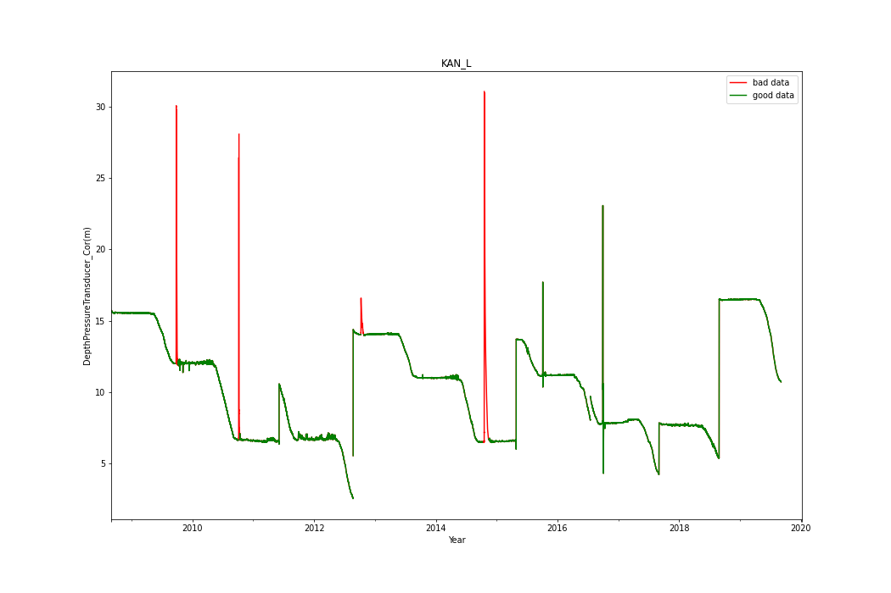
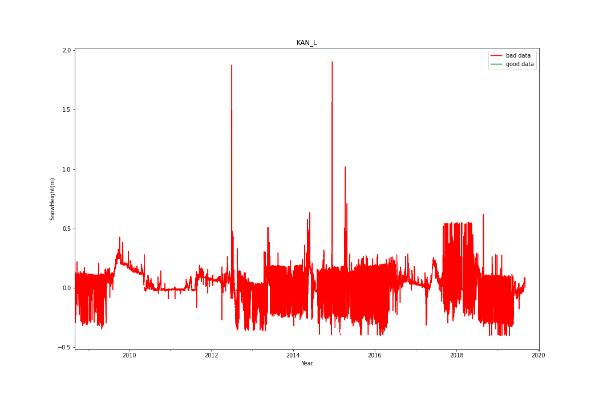
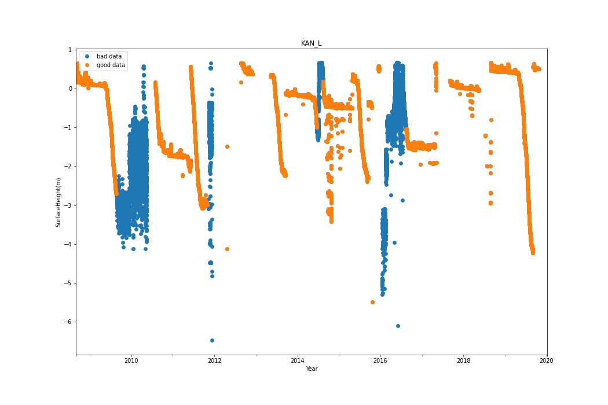
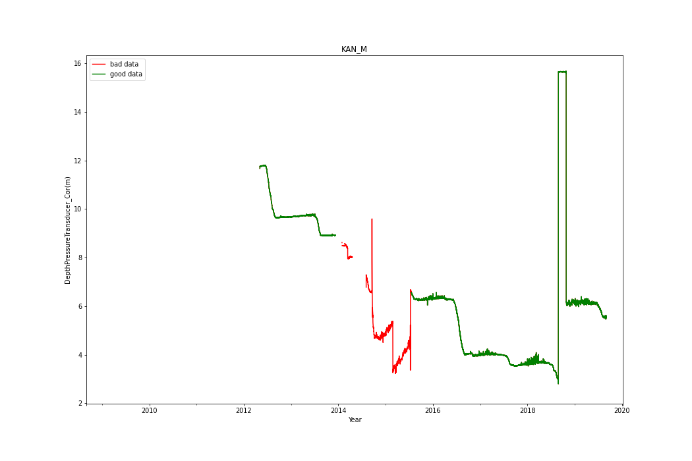
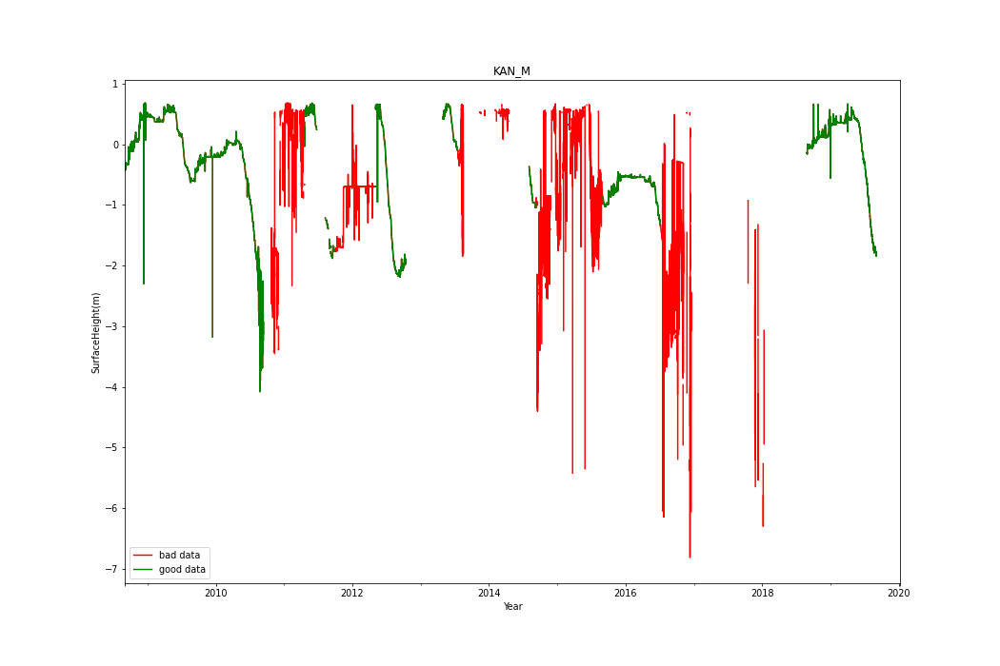
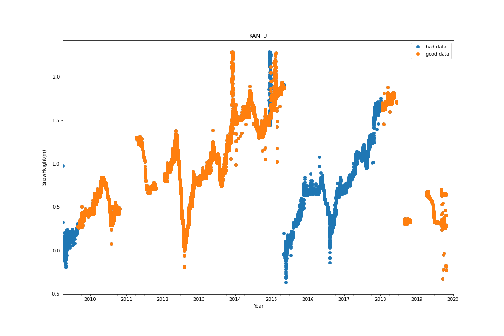
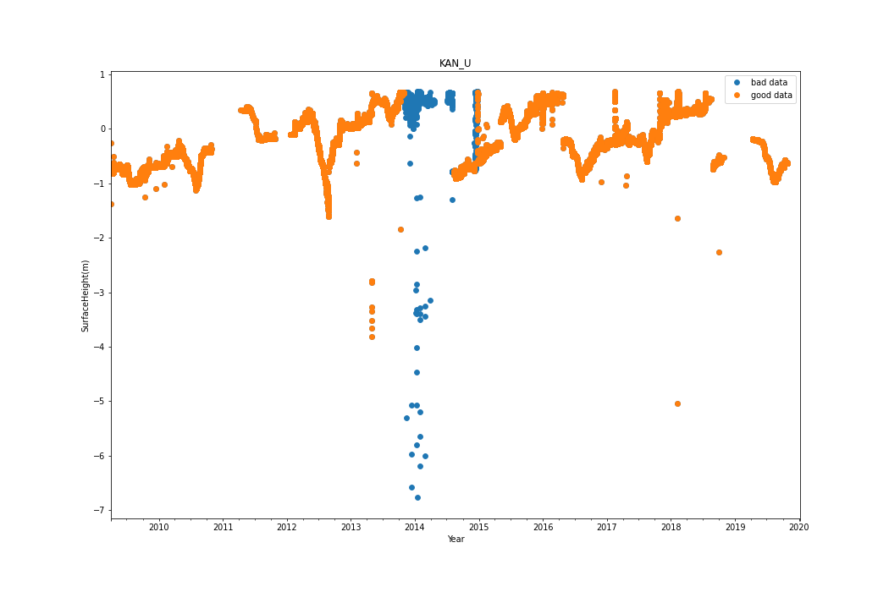

# EGP
## Removing erroneous data at EGP
No erroneous data listed for EGP
## Adjusting data at EGP
### Adjusting SnowHeight(m)
|start time|end time|operation|value|
|-|-|-|-|
|2017-05-18T00:00:00+00:00|nan|add|0.5|
|2018-05-30T00:00:00+00:00|nan|add|0.6|
|2019-05-31T00:00:00+00:00|nan|add|0.4|
.jpeg)
### Adjusting SurfaceHeight(m)
|start time|end time|operation|value|
|-|-|-|-|
|2019-06-01T00:00:00+00:00|nan|add|0.18|
.jpeg)
# KAN_B
## Removing erroneous data at KAN_B
No erroneous data listed for KAN_B
## Adjusting data at KAN_B
No data to fix for KAN_B
# KAN_L
## Removing erroneous data at KAN_L
Deleting flagged data:
|start time|end time|variable|
|-|-|-|
|2009-09-17 00:00:00+00:00|2009-10-07 00:00:00+00:00|DepthPressureTransducer_Cor(m)|
|2010-10-02 00:00:00+00:00|2010-10-12 00:00:00+00:00|DepthPressureTransducer_Cor(m)|
|2012-10-06 00:00:00+00:00|2012-10-26 00:00:00+00:00|DepthPressureTransducer_Cor(m)|
|2014-10-08 00:00:00+00:00|2014-11-16 00:00:00+00:00|DepthPressureTransducer_Cor(m)|
|2019-10-07 00:00:00+00:00|2019-10-27 00:00:00+00:00|DepthPressureTransducer_Cor(m)|

|start time|end time|variable|
|-|-|-|
|2008-01-01 00:00:00+00:00|2020-01-01 00:00:00+00:00|SnowHeight(m)|

|start time|end time|variable|
|-|-|-|
|2009-08-20 00:00:00+00:00|2010-06-01 00:00:00+00:00|SurfaceHeight(m)|
|2011-11-01 00:00:00+00:00|2012-02-01 00:00:00+00:00|SurfaceHeight(m)|
|2014-06-20 00:00:00+00:00|2014-08-15 00:00:00+00:00|SurfaceHeight(m)|
|2016-01-01 00:00:00+00:00|2016-08-15 00:00:00+00:00|SurfaceHeight(m)|

## Adjusting data at KAN_L
### Adjusting DepthPressureTransducer_Cor(m)
|start time|end time|operation|value|
|-|-|-|-|
|2010-10-07T00:00:00+00:00|nan|add|-0.1|
|2011-06-04T00:00:00+00:00|nan|add|-4.0|
|2012-08-21T00:00:00+00:00|nan|add|-11.7|
|2014-05-13T00:00:00+00:00|nan|add|0.07|
|2015-04-29T00:00:00+00:00|nan|add|-7.08|
|2015-07-07T00:00:00+00:00|nan|add|-0.4|
|2016-07-16T00:00:00+00:00|nan|add|-1.6|
|2017-09-01T00:00:00+00:00|nan|add|-3.5|
|2018-08-29T00:00:00+00:00|nan|add|-11.3|
|2019-09-05T00:00:00+00:00|nan|add|6.5|
.jpeg)
### Adjusting SurfaceHeight(m)
|start time|end time|operation|value|
|-|-|-|-|
|2011-06-03T00:00:00+00:00|nan|add|-3.0|
|2013-09-15T00:00:00+00:00|nan|add|-2.2|
|2014-07-15T00:00:00+00:00|nan|add|-4.0|
|2015-09-15T00:00:00+00:00|nan|add|-2.0|
|2019-09-05T00:00:00+00:00|nan|add|-5.0|
.jpeg)
# KAN_M
## Removing erroneous data at KAN_M
Deleting flagged data:
|start time|end time|variable|
|-|-|-|
|2013-12-31 00:00:00+00:00|2015-07-19 00:00:00+00:00|DepthPressureTransducer_Cor(m)|

|start time|end time|variable|
|-|-|-|
|2010-09-30 00:00:00+00:00|2011-04-19 00:00:00+00:00|SurfaceHeight(m)|
|2011-09-30 00:00:00+00:00|2012-05-01 00:00:00+00:00|SurfaceHeight(m)|
|2013-07-15 00:00:00+00:00|2014-06-01 00:00:00+00:00|SurfaceHeight(m)|
|2014-09-05 00:00:00+00:00|2015-09-01 00:00:00+00:00|SurfaceHeight(m)|
|2016-07-05 00:00:00+00:00|2018-06-01 00:00:00+00:00|SurfaceHeight(m)|

## Adjusting data at KAN_M
### Adjusting DepthPressureTransducer_Cor(m)
|start time|end time|operation|value|
|-|-|-|-|
|2015-03-01T00:00:00+00:00|nan|add|2.3|
|2018-08-28T00:00:00+00:00|nan|add|-12.7|
|2018-10-29T00:00:00+00:00|nan|add|9.5|
|2019-09-05T00:00:00+00:00|nan|add|2.3|
.jpeg)
### Adjusting SurfaceHeight(m)
|start time|end time|operation|value|
|-|-|-|-|
|2011-04-29T00:00:00+00:00|nan|add|-2.8|
|2012-05-05T00:00:00+00:00|nan|add|-1.3|
|2013-04-29T00:00:00+00:00|nan|add|-2.0|
|2019-09-06T00:00:00+00:00|nan|add|-1.8|
.jpeg)
# KAN_U
## Removing erroneous data at KAN_U
Deleting flagged data:
|start time|end time|variable|
|-|-|-|
|2009-04-04 00:00:00+00:00|2009-09-01 00:00:00+00:00|SnowHeight(m)|
|2015-05-03 11:00:00+00:00|2018-01-17 00:00:00+00:00|SnowHeight(m)|
|2014-12-06 20:00:00+00:00|2014-12-23 00:00:00+00:00|SnowHeight(m)|

|start time|end time|variable|
|-|-|-|
|2013-10-28 21:00:00+00:00|2014-08-10 00:00:00+00:00|SurfaceHeight(m)|
|2011-10-26 05:00:00+00:00|2012-01-08 00:00:00+00:00|SurfaceHeight(m)|
|2014-12-06 20:00:00+00:00|2014-12-23 00:00:00+00:00|SurfaceHeight(m)|

## Adjusting data at KAN_U
### Adjusting SnowHeight(m)
|start time|end time|operation|value|
|-|-|-|-|
|2015-05-05T00:00:00+00:00|nan|add|1.9|
.jpeg)
### Adjusting SurfaceHeight(m)
|start time|end time|operation|value|
|-|-|-|-|
|2012-08-27T00:00:00+00:00|nan|add|-0.5|
|2014-07-29T00:00:00+00:00|nan|add|1.2|
|2018-08-28T00:00:00+00:00|nan|add|1.0|
.jpeg)
