* [EGP](#s1)
  * [Removing erroneous data at EGP](#s1-1)
  * [Adjusting data at EGP](#s1-2)
      * [Adjusting SnowHeight(m)](#s1-2-1)
      * [Adjusting SurfaceHeight(m)](#s1-2-2)
  * [Summarizing surface height at EGP](#s1-3)
* [KAN_B](#s2)
  * [Removing erroneous data at KAN_B](#s2-1)
  * [Adjusting data at KAN_B](#s2-2)
  * [Summarizing surface height at KAN_B](#s2-3)
* [KAN_L](#s3)
  * [Removing erroneous data at KAN_L](#s3-1)
  * [Adjusting data at KAN_L](#s3-2)
      * [Adjusting DepthPressureTransducer_Cor(m)](#s3-2-1)
      * [Adjusting SurfaceHeight(m)](#s3-2-2)
  * [Summarizing surface height at KAN_L](#s3-3)
* [KAN_M](#s4)
  * [Removing erroneous data at KAN_M](#s4-1)
  * [Adjusting data at KAN_M](#s4-2)
      * [Adjusting DepthPressureTransducer_Cor(m)](#s4-2-1)
      * [Adjusting SurfaceHeight(m)](#s4-2-2)
  * [Summarizing surface height at KAN_M](#s4-3)
* [KAN_U](#s5)
  * [Removing erroneous data at KAN_U](#s5-1)
  * [Adjusting data at KAN_U](#s5-2)
      * [Adjusting SnowHeight(m)](#s5-2-1)
      * [Adjusting SurfaceHeight(m)](#s5-2-2)
  * [Summarizing surface height at KAN_U](#s5-3)
* [KPC_L](#s6)
  * [Removing erroneous data at KPC_L](#s6-1)
  * [Adjusting data at KPC_L](#s6-2)
      * [Adjusting DepthPressureTransducer_Cor(m)](#s6-2-1)
      * [Adjusting SurfaceHeight(m)](#s6-2-2)
  * [Summarizing surface height at KPC_L](#s6-3)
* [KPC_U](#s7)
  * [Removing erroneous data at KPC_U](#s7-1)
  * [Adjusting data at KPC_U](#s7-2)
      * [Adjusting SnowHeight(m)](#s7-2-1)
      * [Adjusting SurfaceHeight(m)](#s7-2-2)
  * [Summarizing surface height at KPC_U](#s7-3)
* [MIT](#s8)
  * [Removing erroneous data at MIT](#s8-1)
  * [Adjusting data at MIT](#s8-2)
      * [Adjusting DepthPressureTransducer_Cor(m)](#s8-2-1)
      * [Adjusting SurfaceHeight(m)](#s8-2-2)
  * [Summarizing surface height at MIT](#s8-3)
* [NUK_K](#s9)
  * [Removing erroneous data at NUK_K](#s9-1)
  * [Adjusting data at NUK_K](#s9-2)
      * [Adjusting DepthPressureTransducer_Cor(m)](#s9-2-1)
      * [Adjusting SnowHeight(m)](#s9-2-2)
  * [Summarizing surface height at NUK_K](#s9-3)
* [NUK_L](#s10)
  * [Removing erroneous data at NUK_L](#s10-1)
  * [Adjusting data at NUK_L](#s10-2)
      * [Adjusting DepthPressureTransducer_Cor(m)](#s10-2-1)
      * [Adjusting SnowHeight(m)](#s10-2-2)
      * [Adjusting SurfaceHeight(m)](#s10-2-3)
  * [Summarizing surface height at NUK_L](#s10-3)
* [NUK_U](#s11)
  * [Removing erroneous data at NUK_U](#s11-1)
  * [Adjusting data at NUK_U](#s11-2)
      * [Adjusting DepthPressureTransducer_Cor(m)](#s11-2-1)
      * [Adjusting SurfaceHeight(m)](#s11-2-2)
  * [Summarizing surface height at NUK_U](#s11-3)
* [QAS_L](#s12)
  * [Removing erroneous data at QAS_L](#s12-1)
  * [Adjusting data at QAS_L](#s12-2)
      * [Adjusting DepthPressureTransducer_Cor(m)](#s12-2-1)
      * [Adjusting SurfaceHeight(m)](#s12-2-2)
  * [Summarizing surface height at QAS_L](#s12-3)
* [QAS_M](#s13)
  * [Removing erroneous data at QAS_M](#s13-1)
  * [Adjusting data at QAS_M](#s13-2)
      * [Adjusting DepthPressureTransducer_Cor(m)](#s13-2-1)
      * [Adjusting SurfaceHeight(m)](#s13-2-2)
  * [Summarizing surface height at QAS_M](#s13-3)
* [QAS_U](#s14)
  * [Removing erroneous data at QAS_U](#s14-1)
  * [Adjusting data at QAS_U](#s14-2)
      * [Adjusting DepthPressureTransducer_Cor(m)](#s14-2-1)
      * [Adjusting SurfaceHeight(m)](#s14-2-2)
  * [Summarizing surface height at QAS_U](#s14-3)
* [SCO_L](#s15)
  * [Removing erroneous data at SCO_L](#s15-1)
  * [Adjusting data at SCO_L](#s15-2)
      * [Adjusting DepthPressureTransducer_Cor(m)](#s15-2-1)
      * [Adjusting SurfaceHeight(m)](#s15-2-2)
  * [Summarizing surface height at SCO_L](#s15-3)
* [SCO_U](#s16)
  * [Removing erroneous data at SCO_U](#s16-1)
  * [Adjusting data at SCO_U](#s16-2)
      * [Adjusting DepthPressureTransducer_Cor(m)](#s16-2-1)
      * [Adjusting SurfaceHeight(m)](#s16-2-2)
  * [Summarizing surface height at SCO_U](#s16-3)
* [TAS_A](#s17)
  * [Removing erroneous data at TAS_A](#s17-1)
  * [Adjusting data at TAS_A](#s17-2)
      * [Adjusting DepthPressureTransducer_Cor(m)](#s17-2-1)
      * [Adjusting SurfaceHeight(m)](#s17-2-2)
  * [Summarizing surface height at TAS_A](#s17-3)
* [TAS_L](#s18)
  * [Removing erroneous data at TAS_L](#s18-1)
  * [Adjusting data at TAS_L](#s18-2)
      * [Adjusting DepthPressureTransducer_Cor(m)](#s18-2-1)
      * [Adjusting SurfaceHeight(m)](#s18-2-2)
  * [Summarizing surface height at TAS_L](#s18-3)
* [THU_L](#s19)
  * [Removing erroneous data at THU_L](#s19-1)
  * [Adjusting data at THU_L](#s19-2)
  * [Summarizing surface height at THU_L](#s19-3)
* [THU_U](#s20)
  * [Removing erroneous data at THU_U](#s20-1)
  * [Adjusting data at THU_U](#s20-2)
  * [Summarizing surface height at THU_U](#s20-3)
* [UPE_L](#s21)
  * [Removing erroneous data at UPE_L](#s21-1)
  * [Adjusting data at UPE_L](#s21-2)
      * [Adjusting DepthPressureTransducer_Cor(m)](#s21-2-1)
      * [Adjusting SurfaceHeight(m)](#s21-2-2)
  * [Summarizing surface height at UPE_L](#s21-3)
* [UPE_U](#s22)
  * [Removing erroneous data at UPE_U](#s22-1)
  * [Adjusting data at UPE_U](#s22-2)
      * [Adjusting DepthPressureTransducer_Cor(m)](#s22-2-1)
      * [Adjusting SurfaceHeight(m)](#s22-2-2)
  * [Summarizing surface height at UPE_U](#s22-3)
# <a id='s1' />EGP
## <a id='s1-1' />Removing erroneous data at EGP
No erroneous data listed for EGP
## <a id='s1-2' />Adjusting data at EGP
### <a id='s1-2-1' />Adjusting SnowHeight(m)
|start time|end time|operation|value|
|-|-|-|-|
|2017-05-18T00:00:00+00:00|nan|add|0.5|
|2018-05-30T00:00:00+00:00|nan|add|0.6|
|2019-05-31T00:00:00+00:00|nan|add|0.4|
 
.jpeg)
 
### <a id='s1-2-2' />Adjusting SurfaceHeight(m)
|start time|end time|operation|value|
|-|-|-|-|
|2019-06-01T00:00:00+00:00|nan|add|0.18|
 
.jpeg)
 
## <a id='s1-3' />Summarizing surface height at EGP
 

 
# <a id='s2' />KAN_B
## <a id='s2-1' />Removing erroneous data at KAN_B
No erroneous data listed for KAN_B
## <a id='s2-2' />Adjusting data at KAN_B
No data to fix at KAN_B
## <a id='s2-3' />Summarizing surface height at KAN_B
 

 
# <a id='s3' />KAN_L
## <a id='s3-1' />Removing erroneous data at KAN_L
Flagging data:
|start time|end time|variable|
|-|-|-|
|2009-09-17 00:00:00+00:00|2009-10-07 00:00:00+00:00|DepthPressureTransducer_Cor(m)|
|2010-10-02 00:00:00+00:00|2010-10-12 00:00:00+00:00|DepthPressureTransducer_Cor(m)|
|2012-10-06 00:00:00+00:00|2012-10-26 00:00:00+00:00|DepthPressureTransducer_Cor(m)|
|2014-10-08 00:00:00+00:00|2014-11-16 00:00:00+00:00|DepthPressureTransducer_Cor(m)|
|2019-10-07 00:00:00+00:00|2019-10-27 00:00:00+00:00|DepthPressureTransducer_Cor(m)|
 

 
|start time|end time|variable|
|-|-|-|
|2008-01-01 00:00:00+00:00|2009-09-01 00:00:00+00:00|SnowHeight(m)|
|2012-01-01 00:00:00+00:00|2016-09-01 00:00:00+00:00|SnowHeight(m)|
|2017-09-01 00:00:00+00:00|2020-09-01 00:00:00+00:00|SnowHeight(m)|
 

 
|start time|end time|variable|
|-|-|-|
|2009-08-20 00:00:00+00:00|2010-06-01 00:00:00+00:00|SurfaceHeight(m)|
|2011-11-01 00:00:00+00:00|2012-02-01 00:00:00+00:00|SurfaceHeight(m)|
|2014-06-20 00:00:00+00:00|2014-08-15 00:00:00+00:00|SurfaceHeight(m)|
|2016-01-01 00:00:00+00:00|2016-08-15 00:00:00+00:00|SurfaceHeight(m)|
 

 
## <a id='s3-2' />Adjusting data at KAN_L
### <a id='s3-2-1' />Adjusting DepthPressureTransducer_Cor(m)
|start time|end time|operation|value|
|-|-|-|-|
|2010-10-07T00:00:00+00:00|nan|add|-0.1|
|2011-06-04T00:00:00+00:00|nan|add|-4.0|
|2012-08-21T00:00:00+00:00|nan|add|-11.7|
|2014-05-13T00:00:00+00:00|nan|add|0.07|
|2015-04-29T00:00:00+00:00|nan|add|-7.08|
|2015-07-07T00:00:00+00:00|nan|add|-0.4|
|2016-07-16T00:00:00+00:00|nan|add|-1.6|
|2017-09-01T00:00:00+00:00|nan|add|-3.5|
|2018-08-29T00:00:00+00:00|nan|add|-11.3|
|2019-09-05T00:00:00+00:00|nan|add|6.5|
 
.jpeg)
 
### <a id='s3-2-2' />Adjusting SurfaceHeight(m)
|start time|end time|operation|value|
|-|-|-|-|
|2011-06-03T00:00:00+00:00|nan|add|-3.0|
|2013-09-15T00:00:00+00:00|nan|add|-2.2|
|2014-07-15T00:00:00+00:00|nan|add|-4.0|
|2015-09-15T00:00:00+00:00|nan|add|-2.0|
|2019-09-05T00:00:00+00:00|nan|add|-5.0|
 
.jpeg)
 
## <a id='s3-3' />Summarizing surface height at KAN_L
 

 
# <a id='s4' />KAN_M
## <a id='s4-1' />Removing erroneous data at KAN_M
Flagging data:
|start time|end time|variable|
|-|-|-|
|2013-12-31 00:00:00+00:00|2015-07-19 00:00:00+00:00|DepthPressureTransducer_Cor(m)|
 

 
|start time|end time|variable|
|-|-|-|
|2010-09-30 00:00:00+00:00|2011-04-21 00:00:00+00:00|SurfaceHeight(m)|
|2011-09-30 00:00:00+00:00|2012-05-01 00:00:00+00:00|SurfaceHeight(m)|
|2013-07-15 00:00:00+00:00|2014-06-01 00:00:00+00:00|SurfaceHeight(m)|
|2014-09-05 00:00:00+00:00|2015-09-01 00:00:00+00:00|SurfaceHeight(m)|
|2016-07-05 00:00:00+00:00|2018-06-01 00:00:00+00:00|SurfaceHeight(m)|
 

 
## <a id='s4-2' />Adjusting data at KAN_M
### <a id='s4-2-1' />Adjusting DepthPressureTransducer_Cor(m)
|start time|end time|operation|value|
|-|-|-|-|
|2015-03-01T00:00:00+00:00|nan|add|2.3|
|2018-08-28T00:00:00+00:00|nan|add|-12.7|
|2018-10-29T00:00:00+00:00|nan|add|9.5|
|2019-09-05T00:00:00+00:00|nan|add|2.3|
 
.jpeg)
 
### <a id='s4-2-2' />Adjusting SurfaceHeight(m)
|start time|end time|operation|value|
|-|-|-|-|
|2011-04-21T00:00:00+00:00|nan|add|-2.8|
|2012-05-04T00:00:00+00:00|nan|add|-1.3|
|2013-04-29T00:00:00+00:00|nan|add|-2.0|
|2019-09-06T00:00:00+00:00|nan|add|-1.8|
 
.jpeg)
 
## <a id='s4-3' />Summarizing surface height at KAN_M
 
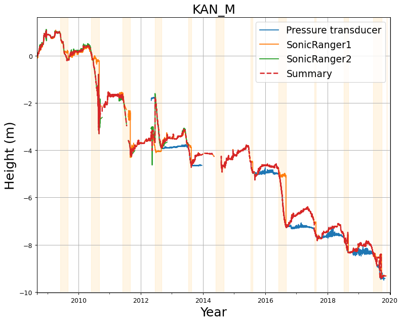
 
# <a id='s5' />KAN_U
## <a id='s5-1' />Removing erroneous data at KAN_U
Flagging data:
|start time|end time|variable|
|-|-|-|
|2009-04-04 00:00:00+00:00|2009-09-01 00:00:00+00:00|SnowHeight(m)|
|2015-05-03 11:00:00+00:00|2018-01-17 00:00:00+00:00|SnowHeight(m)|
|2014-12-06 20:00:00+00:00|2014-12-23 00:00:00+00:00|SnowHeight(m)|
 

 
|start time|end time|variable|
|-|-|-|
|2013-10-28 21:00:00+00:00|2014-08-10 00:00:00+00:00|SurfaceHeight(m)|
|2011-10-26 05:00:00+00:00|2012-01-08 00:00:00+00:00|SurfaceHeight(m)|
|2014-12-06 20:00:00+00:00|2014-12-23 00:00:00+00:00|SurfaceHeight(m)|
 

 
## <a id='s5-2' />Adjusting data at KAN_U
### <a id='s5-2-1' />Adjusting SnowHeight(m)
|start time|end time|operation|value|
|-|-|-|-|
|2015-05-05T00:00:00+00:00|nan|add|1.9|
 
.jpeg)
 
### <a id='s5-2-2' />Adjusting SurfaceHeight(m)
|start time|end time|operation|value|
|-|-|-|-|
|2012-08-27T00:00:00+00:00|nan|add|-0.5|
|2014-07-29T00:00:00+00:00|nan|add|1.2|
|2018-08-28T00:00:00+00:00|nan|add|1.0|
 
.jpeg)
 
## <a id='s5-3' />Summarizing surface height at KAN_U
 

 
# <a id='s6' />KPC_L
## <a id='s6-1' />Removing erroneous data at KPC_L
Flagging data:
|start time|end time|variable|
|-|-|-|
|2012-07-19 00:00:00+00:00|2012-07-21 00:00:00+00:00|DepthPressureTransducer_Cor(m)|
|2019-08-25 12:00:00+00:00|2019-08-27 00:00:00+00:00|DepthPressureTransducer_Cor(m)|
|2019-09-07 00:00:00+00:00|2019-09-11 00:00:00+00:00|DepthPressureTransducer_Cor(m)|
|2019-09-15 00:00:00+00:00|2020-01-01 00:00:00+00:00|DepthPressureTransducer_Cor(m)|
 

 
|start time|end time|variable|
|-|-|-|
|2012-07-19 00:00:00+00:00|2012-07-30 00:00:00+00:00|SnowHeight(m)|
 

 
|start time|end time|variable|
|-|-|-|
|2009-08-20 00:00:00+00:00|2010-01-31 00:00:00+00:00|SurfaceHeight(m)|
|2013-09-01 00:00:00+00:00|2014-07-28 00:00:00+00:00|SurfaceHeight(m)|
|2014-07-20 00:00:00+00:00|2015-02-28 00:00:00+00:00|SurfaceHeight(m)|
|2016-11-01 00:00:00+00:00|2019-07-30 00:00:00+00:00|SurfaceHeight(m)|
 

 
## <a id='s6-2' />Adjusting data at KPC_L
### <a id='s6-2-1' />Adjusting DepthPressureTransducer_Cor(m)
|start time|end time|operation|value|
|-|-|-|-|
|2010-01-01T00:00:00+00:00|nan|add|-6.0|
|2016-07-27T00:00:00+00:00|nan|add|-6.297000000000001|
|2016-07-29T00:00:00+00:00|nan|add|-0.1|
|2019-07-12T13:00:00+00:00|nan|add|-4.478|
 
.jpeg)
 
### <a id='s6-2-2' />Adjusting SurfaceHeight(m)
|start time|end time|operation|value|
|-|-|-|-|
|2012-01-01T00:00:00+00:00|nan|add|-7.0|
 
.jpeg)
 
## <a id='s6-3' />Summarizing surface height at KPC_L
 
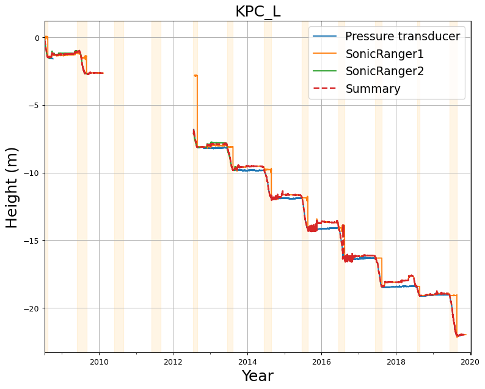
 
# <a id='s7' />KPC_U
## <a id='s7-1' />Removing erroneous data at KPC_U
Flagging data:
|start time|end time|variable|
|-|-|-|
|2006-07-10 00:00:00+00:00|2020-01-10 00:00:00+00:00|DepthPressureTransducer_Cor(m)|
 

 
## <a id='s7-2' />Adjusting data at KPC_U
### <a id='s7-2-1' />Adjusting SnowHeight(m)
|start time|end time|operation|value|
|-|-|-|-|
|2012-07-21T00:00:00+00:00|nan|add|0.3|
|2019-06-24T00:00:00+00:00|nan|add|-0.1|
|2019-07-03T00:00:00+00:00|nan|add|-0.65|
|2019-07-13T12:00:00+00:00|nan|add|1.75|
 
.jpeg)
 
### <a id='s7-2-2' />Adjusting SurfaceHeight(m)
|start time|end time|operation|value|
|-|-|-|-|
|2007-07-23T00:00:00+00:00|2021-07-23T00:00:00+00:00|min_filter|-1.5|
|2012-07-23T00:00:00+00:00|nan|add|-0.2|
 
.jpeg)
 
## <a id='s7-3' />Summarizing surface height at KPC_U
 
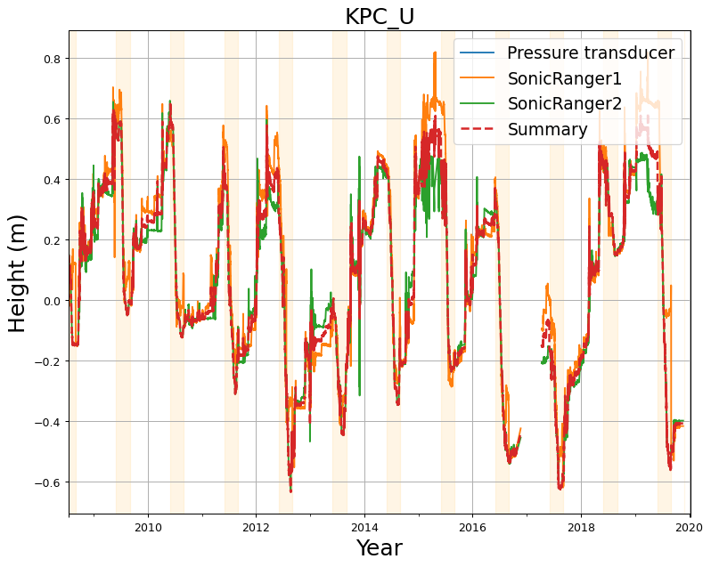
 
# <a id='s8' />MIT
## <a id='s8-1' />Removing erroneous data at MIT
Flagging data:
|start time|end time|variable|
|-|-|-|
|2008-06-01 00:00:00+00:00|2009-08-12 00:00:00+00:00|DepthPressureTransducer_Cor(m)|
|2015-12-31 00:00:00+00:00|2016-05-29 00:00:00+00:00|DepthPressureTransducer_Cor(m)|
|2016-01-02 00:00:00+00:00|2017-07-01 00:00:00+00:00|DepthPressureTransducer_Cor(m)|
|2017-10-01 00:00:00+00:00|2018-07-01 00:00:00+00:00|DepthPressureTransducer_Cor(m)|
|2018-10-01 00:00:00+00:00|2018-11-01 00:00:00+00:00|DepthPressureTransducer_Cor(m)|
|2019-01-02 00:00:00+00:00|2019-07-01 00:00:00+00:00|DepthPressureTransducer_Cor(m)|
|2019-09-10 00:00:00+00:00|2019-11-01 00:00:00+00:00|DepthPressureTransducer_Cor(m)|
 

 
Warning: interpreting LongwaveRadiationDownWm2 as LongwaveRadiationDown(W/m2)
|start time|end time|variable|
|-|-|-|
|2019-04-01 00:00:00+00:00|2019-07-31 00:00:00+00:00|LongwaveRadiationDown(W/m2)|
 

 
Warning: interpreting ShortwaveRadiationDownWm2 as ShortwaveRadiationDown(W/m2)
|start time|end time|variable|
|-|-|-|
|2013-01-25 11:00:00+00:00|2013-06-21 00:00:00+00:00|ShortwaveRadiationDown(W/m2)|
|2015-01-25 11:00:00+00:00|2015-07-21 00:00:00+00:00|ShortwaveRadiationDown(W/m2)|
 

 
Warning: interpreting ShortwaveRadiationUpWm2 as ShortwaveRadiationUp(W/m2)
|start time|end time|variable|
|-|-|-|
|2013-01-25 11:00:00+00:00|2013-06-21 00:00:00+00:00|ShortwaveRadiationUp(W/m2)|
|2015-01-25 11:00:00+00:00|2015-07-21 00:00:00+00:00|ShortwaveRadiationUp(W/m2)|
 

 
Warning: interpreting SnowHeightm as SnowHeight(m)
|start time|end time|variable|
|-|-|-|
|2008-06-01 00:00:00+00:00|2010-01-01 00:00:00+00:00|SnowHeight(m)|
 

 
Warning: interpreting SurfaceHeightm as SurfaceHeight(m)
|start time|end time|variable|
|-|-|-|
|2010-12-14 00:00:00+00:00|2011-08-12 00:00:00+00:00|SurfaceHeight(m)|
|2012-02-03 00:00:00+00:00|2012-06-03 00:00:00+00:00|SurfaceHeight(m)|
|2013-01-01 00:00:00+00:00|2013-09-09 00:00:00+00:00|SurfaceHeight(m)|
|2014-09-20 00:00:00+00:00|2015-08-14 00:00:00+00:00|SurfaceHeight(m)|
|2015-09-15 00:00:00+00:00|2015-12-14 00:00:00+00:00|SurfaceHeight(m)|
|2016-06-15 00:00:00+00:00|2016-07-14 00:00:00+00:00|SurfaceHeight(m)|
 

 
## <a id='s8-2' />Adjusting data at MIT
### <a id='s8-2-1' />Adjusting DepthPressureTransducer_Cor(m)
|start time|end time|operation|value|
|-|-|-|-|
|2009-08-12T00:00:00+00:00|nan|add|-12.0|
|2010-09-01T00:00:00+00:00|nan|add|2.0|
|2011-08-11T00:00:00+00:00|nan|add|-0.08|
|2012-09-06T00:00:00+00:00|nan|add|-13.7|
|2018-07-01T00:00:00+00:00|nan|add|-2.0|
|2019-01-12T00:00:00+00:00|nan|add|-2.0|
 
.jpeg)
 
### <a id='s8-2-2' />Adjusting SurfaceHeight(m)
|start time|end time|operation|value|
|-|-|-|-|
|2009-08-11T16:00:00+00:00|nan|add|-3.2|
|2010-08-08T00:00:00+00:00|nan|add|-3.0|
|2011-08-06T00:00:00+00:00|nan|add|-3.0|
|2012-06-01T00:00:00+00:00|nan|add|1.4|
|2012-09-06T00:00:00+00:00|nan|add|-2.3|
|2014-07-31T15:00:00+00:00|nan|add|-0.8|
|2015-07-31T15:00:00+00:00|nan|add|-1.8|
 
.jpeg)
 
## <a id='s8-3' />Summarizing surface height at MIT
 
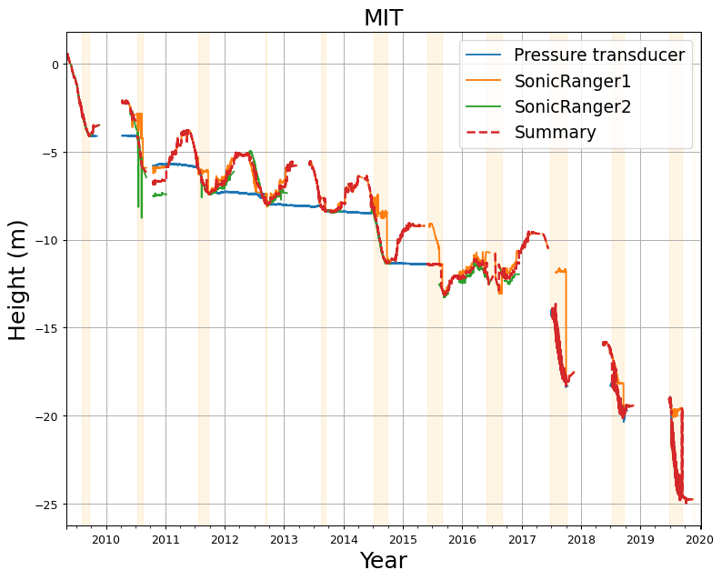
 
# <a id='s9' />NUK_K
## <a id='s9-1' />Removing erroneous data at NUK_K
Flagging data:
Warning: interpreting LongwaveRadiationDownWm2 as LongwaveRadiationDown(W/m2)
|start time|end time|variable|
|-|-|-|
|2015-04-01 00:00:00+00:00|2015-06-20 00:00:00+00:00|LongwaveRadiationDown(W/m2)|
 

 
Warning: interpreting ShortwaveRadiationDownWm2 as ShortwaveRadiationDown(W/m2)
|start time|end time|variable|
|-|-|-|
|2015-01-25 11:00:00+00:00|2015-06-21 00:00:00+00:00|ShortwaveRadiationDown(W/m2)|
|2017-01-15 16:00:00+00:00|2017-06-11 00:00:00+00:00|ShortwaveRadiationDown(W/m2)|
 

 
Warning: interpreting ShortwaveRadiationUpWm2 as ShortwaveRadiationUp(W/m2)
|start time|end time|variable|
|-|-|-|
|2015-01-25 11:00:00+00:00|2015-06-21 00:00:00+00:00|ShortwaveRadiationUp(W/m2)|
|2017-01-15 16:00:00+00:00|2017-06-21 00:00:00+00:00|ShortwaveRadiationUp(W/m2)|
 

 
|start time|end time|variable|
|-|-|-|
|2014-07-28 00:00:00+00:00|2014-09-04 00:00:00+00:00|SurfaceHeight(m)|
|2015-07-11 02:00:00+00:00|2015-07-25 00:00:00+00:00|SurfaceHeight(m)|
|2017-08-24 11:00:00+00:00|2017-09-19 00:00:00+00:00|SurfaceHeight(m)|
 

 
Warning: interpreting UpwardRadiationDownWm2 as LongwaveRadiationDown(W/m2)
|start time|end time|variable|
|-|-|-|
|2015-03-25 00:00:00+00:00|2015-06-20 00:00:00+00:00|LongwaveRadiationDown(W/m2)|
|2017-04-15 16:00:00+00:00|2017-05-11 00:00:00+00:00|LongwaveRadiationDown(W/m2)|
 

 
Warning: interpreting WindSpeed2ms as WindSpeed(m/s)
|start time|end time|variable|
|-|-|-|
|2017-03-15 16:00:00+00:00|2017-05-11 00:00:00+00:00|WindSpeed(m/s)|
 

 
## <a id='s9-2' />Adjusting data at NUK_K
### <a id='s9-2-1' />Adjusting DepthPressureTransducer_Cor(m)
|start time|end time|operation|value|
|-|-|-|-|
|2014-08-12T00:00:00+00:00|nan|add|1.25|
|2014-08-28T00:00:00+00:00|nan|add|-1.25|
|2018-06-26T00:00:00+00:00|nan|add|0.07|
|2019-08-17T00:00:00+00:00|nan|add|1.0|
|2019-09-12T00:00:00+00:00|nan|add|-1.0|
 
.jpeg)
 
### <a id='s9-2-2' />Adjusting SnowHeight(m)
|start time|end time|operation|value|
|-|-|-|-|
|2017-07-04T00:00:00+00:00|nan|add|-0.7|
 
.jpeg)
 
## <a id='s9-3' />Summarizing surface height at NUK_K
 

 
# <a id='s10' />NUK_L
## <a id='s10-1' />Removing erroneous data at NUK_L
No erroneous data listed for NUK_L
## <a id='s10-2' />Adjusting data at NUK_L
### <a id='s10-2-1' />Adjusting DepthPressureTransducer_Cor(m)
|start time|end time|operation|value|
|-|-|-|-|
|2008-07-29T00:00:00+00:00|nan|add|-5.0|
|2008-07-30T00:00:00+00:00|nan|add|-7.1|
|2009-08-24T00:00:00+00:00|nan|add|-0.5|
|2010-07-25T00:00:00+00:00|nan|add|-11.1|
|2011-07-28T00:00:00+00:00|nan|add|-1.15|
|2011-08-26T00:00:00+00:00|nan|add|-1.2|
|2011-08-29T00:00:00+00:00|nan|add|1.0|
|2012-08-28T00:00:00+00:00|nan|add|-12.0|
|2013-01-24T00:00:00+00:00|nan|add|2.6|
|2013-07-23T00:00:00+00:00|nan|add|-5.25|
|2014-07-25T00:00:00+00:00|nan|add|-2.5|
|2014-07-26T00:00:00+00:00|nan|add|-3.35|
|2017-04-27T00:00:00+00:00|nan|add|-14.92|
|2017-05-22T00:00:00+00:00|nan|add|-0.5|
|2018-02-28T00:00:00+00:00|nan|add|-18.0|
|2018-07-16T00:00:00+00:00|nan|add|7.35|
|2018-08-01T00:00:00+00:00|nan|add|-2.7|
 
.jpeg)
 
### <a id='s10-2-2' />Adjusting SnowHeight(m)
|start time|end time|operation|value|
|-|-|-|-|
|2014-07-29T00:00:00+00:00|nan|add|0.25|
 
.jpeg)
 
### <a id='s10-2-3' />Adjusting SurfaceHeight(m)
|start time|end time|operation|value|
|-|-|-|-|
|2010-07-29T00:00:00+00:00|nan|add|-2.5|
|2017-07-04T00:00:00+00:00|nan|add|-2.0|
 
.jpeg)
 
## <a id='s10-3' />Summarizing surface height at NUK_L
 
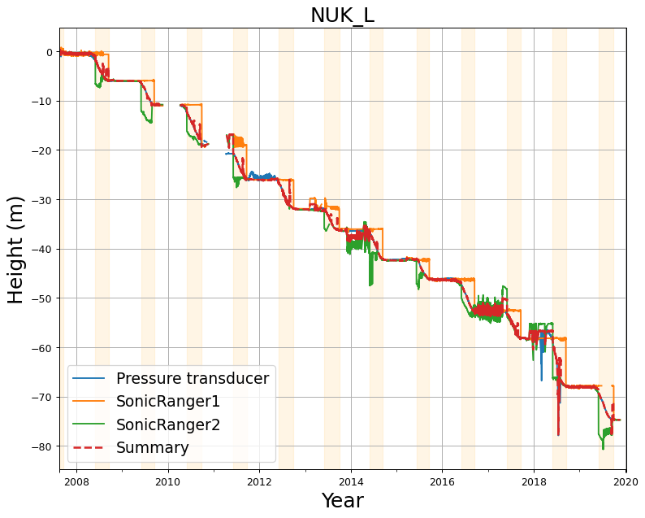
 
# <a id='s11' />NUK_U
## <a id='s11-1' />Removing erroneous data at NUK_U
Flagging data:
|start time|end time|variable|
|-|-|-|
|2011-10-02 00:00:00+00:00|2011-10-27 00:00:00+00:00|DepthPressureTransducer_Cor(m)|
|2014-02-09 00:00:00+00:00|2014-04-10 00:00:00+00:00|DepthPressureTransducer_Cor(m)|
|2016-09-21 00:00:00+00:00|2016-10-26 00:00:00+00:00|DepthPressureTransducer_Cor(m)|
 

 
## <a id='s11-2' />Adjusting data at NUK_U
### <a id='s11-2-1' />Adjusting DepthPressureTransducer_Cor(m)
|start time|end time|operation|value|
|-|-|-|-|
|2010-07-23T00:00:00+00:00|nan|add|-2.6|
|2010-07-24T00:00:00+00:00|nan|add|-8.8|
|2011-08-24T00:00:00+00:00|nan|add|-2.0|
|2013-07-21T00:00:00+00:00|nan|add|-2.0|
|2013-07-22T00:00:00+00:00|nan|add|-5.8|
|2018-07-29T00:00:00+00:00|nan|add|-1.25|
|2018-07-31T00:00:00+00:00|nan|add|-8.0|
 
.jpeg)
 
### <a id='s11-2-2' />Adjusting SurfaceHeight(m)
|start time|end time|operation|value|
|-|-|-|-|
|2011-06-09T00:00:00+00:00|nan|add|-0.8|
|2011-08-18T00:00:00+00:00|nan|add|-1.0|
|2012-08-27T00:00:00+00:00|nan|add|-4.0|
|2017-07-04T00:00:00+00:00|nan|add|-2.5|
|2018-07-29T00:00:00+00:00|nan|add|-2.0|
 
.jpeg)
 
## <a id='s11-3' />Summarizing surface height at NUK_U
 
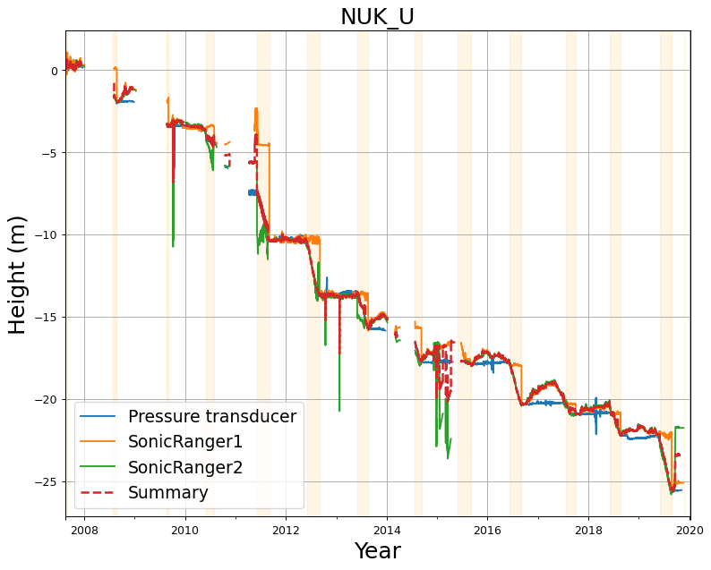
 
# <a id='s12' />QAS_L
## <a id='s12-1' />Removing erroneous data at QAS_L
Flagging data:
|start time|end time|variable|
|-|-|-|
|2013-06-09 00:00:00+00:00|2013-07-01 00:00:00+00:00|DepthPressureTransducer_Cor(m)|
|2019-05-20 00:00:00+00:00|2019-06-24 00:00:00+00:00|DepthPressureTransducer_Cor(m)|
 

 
## <a id='s12-2' />Adjusting data at QAS_L
### <a id='s12-2-1' />Adjusting DepthPressureTransducer_Cor(m)
|start time|end time|operation|value|
|-|-|-|-|
|2008-08-02T00:00:00+00:00|nan|add|-7.0|
|2008-08-07T00:00:00+00:00|nan|add|-1.9|
|2008-10-03T00:00:00+00:00|nan|add|5.1|
|2009-07-03T00:00:00+00:00|nan|add|-3.0|
|2009-07-16T00:00:00+00:00|nan|add|2.0|
|2009-07-29T00:00:00+00:00|nan|add|-7.9|
|2009-09-02T00:00:00+00:00|nan|add|-10.0|
|2010-05-09T00:00:00+00:00|nan|add|-5.0|
|2010-05-31T00:00:00+00:00|nan|add|5.0|
|2011-08-11T00:00:00+00:00|nan|add|-17.0|
|2012-05-11T00:00:00+00:00|nan|add|-0.55|
|2012-08-17T00:00:00+00:00|nan|add|-0.8|
|2014-05-04T00:00:00+00:00|nan|add|-1.48|
|2014-06-08T00:00:00+00:00|nan|add|-0.08|
|2014-08-24T00:00:00+00:00|nan|add|-7.9|
|2016-08-12T00:00:00+00:00|nan|add|-13.3|
|2017-06-01T00:00:00+00:00|nan|add|-0.05|
|2018-05-02T00:00:00+00:00|nan|add|-1.0|
|2018-05-13T00:00:00+00:00|nan|add|-1.0|
|2018-08-27T00:00:00+00:00|nan|add|-8.2|
|2019-05-20T00:00:00+00:00|nan|add|-0.2|
|2019-06-26T00:00:00+00:00|nan|add|-1.0|
|2019-08-29T00:00:00+00:00|nan|add|5.0|
 
.jpeg)
 
### <a id='s12-2-2' />Adjusting SurfaceHeight(m)
|start time|end time|operation|value|
|-|-|-|-|
|2010-07-19T00:00:00+00:00|nan|add|-3.5|
|2012-08-17T00:00:00+00:00|nan|add|-4.0|
|2014-08-23T00:00:00+00:00|nan|add|-3.5|
|2015-08-23T00:00:00+00:00|nan|add|-2.5|
|2019-08-28T00:00:00+00:00|nan|add|-2.0|
 
.jpeg)
 
## <a id='s12-3' />Summarizing surface height at QAS_L
 

 
# <a id='s13' />QAS_M
## <a id='s13-1' />Removing erroneous data at QAS_M
Flagging data:
|start time|end time|variable|
|-|-|-|
|2017-07-15 00:00:00+00:00|2017-08-08 00:00:00+00:00|DepthPressureTransducer_Cor(m)|
|2017-11-11 00:00:00+00:00|2017-12-06 00:00:00+00:00|DepthPressureTransducer_Cor(m)|
|2018-08-30 00:00:00+00:00|2018-08-31 23:00:00+00:00|DepthPressureTransducer_Cor(m)|
 

 
|start time|end time|variable|
|-|-|-|
|2017-12-15 00:00:00+00:00|2018-02-15 00:00:00+00:00|SurfaceHeight(m)|
|2018-12-30 00:00:00+00:00|2019-01-10 00:00:00+00:00|SurfaceHeight(m)|
|2019-07-01 00:00:00+00:00|2019-12-06 00:00:00+00:00|SurfaceHeight(m)|
 

 
## <a id='s13-2' />Adjusting data at QAS_M
### <a id='s13-2-1' />Adjusting DepthPressureTransducer_Cor(m)
|start time|end time|operation|value|
|-|-|-|-|
|2018-08-31T14:00:00+00:00|nan|add|-5.3|
|2019-08-30T00:00:00+00:00|nan|add|4.0|
 
.jpeg)
 
### <a id='s13-2-2' />Adjusting SurfaceHeight(m)
|start time|end time|operation|value|
|-|-|-|-|
|2018-08-31T14:00:00+00:00|nan|add|-2.5|
 
.jpeg)
 
## <a id='s13-3' />Summarizing surface height at QAS_M
 

 
# <a id='s14' />QAS_U
## <a id='s14-1' />Removing erroneous data at QAS_U
Flagging data:
|start time|end time|variable|
|-|-|-|
|2008-10-15 00:00:00+00:00|2010-01-01 00:00:00+00:00|DepthPressureTransducer_Cor(m)|
|2010-10-19 00:00:00+00:00|2010-10-22 00:00:00+00:00|DepthPressureTransducer_Cor(m)|
|2016-08-10 00:00:00+00:00|2017-05-20 00:00:00+00:00|DepthPressureTransducer_Cor(m)|
 

 
## <a id='s14-2' />Adjusting data at QAS_U
### <a id='s14-2-1' />Adjusting DepthPressureTransducer_Cor(m)
|start time|end time|operation|value|
|-|-|-|-|
|2018-09-02T00:00:00+00:00|nan|add|-0.3|
|2019-08-31T00:00:00+00:00|nan|add|4.2|
 
.jpeg)
 
### <a id='s14-2-2' />Adjusting SurfaceHeight(m)
|start time|end time|operation|value|
|-|-|-|-|
|2010-07-19T00:00:00+00:00|nan|add|-2.0|
|2011-08-15T00:00:00+00:00|nan|add|-2.0|
|2013-08-18T00:00:00+00:00|nan|add|-0.5|
|2015-08-23T00:00:00+00:00|nan|add|-1.0|
|2019-09-02T00:00:00+00:00|nan|add|-2.0|
 
.jpeg)
 
## <a id='s14-3' />Summarizing surface height at QAS_U
 
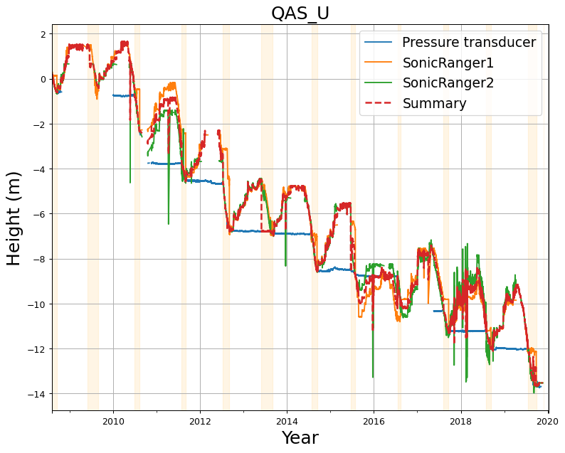
 
# <a id='s15' />SCO_L
## <a id='s15-1' />Removing erroneous data at SCO_L
Flagging data:
|start time|end time|variable|
|-|-|-|
|2014-11-01 00:00:00+00:00|2015-05-16 00:00:00+00:00|DepthPressureTransducer_Cor(m)|
|2018-09-15 00:00:00+00:00|2018-10-27 00:00:00+00:00|DepthPressureTransducer_Cor(m)|
|2019-04-30 00:00:00+00:00|2019-06-11 00:00:00+00:00|DepthPressureTransducer_Cor(m)|
 

 
|start time|end time|variable|
|-|-|-|
|2013-08-11 00:00:00+00:00|2014-08-13 00:00:00+00:00|SurfaceHeight(m)|
|2016-06-03 00:00:00+00:00|2016-09-22 00:00:00+00:00|SurfaceHeight(m)|
 

 
## <a id='s15-2' />Adjusting data at SCO_L
### <a id='s15-2-1' />Adjusting DepthPressureTransducer_Cor(m)
|start time|end time|operation|value|
|-|-|-|-|
|2014-08-10T00:00:00+00:00|nan|add|-14.79|
|2017-08-07T00:00:00+00:00|nan|add|-9.88|
 
.jpeg)
 
### <a id='s15-2-2' />Adjusting SurfaceHeight(m)
|start time|end time|operation|value|
|-|-|-|-|
|2010-07-19T00:00:00+00:00|nan|add|-3.0|
|2012-08-12T00:00:00+00:00|nan|add|-4.0|
|2013-08-12T00:00:00+00:00|nan|add|-4.0|
|2019-08-13T00:00:00+00:00|nan|add|-6.0|
 
.jpeg)
 
## <a id='s15-3' />Summarizing surface height at SCO_L
 
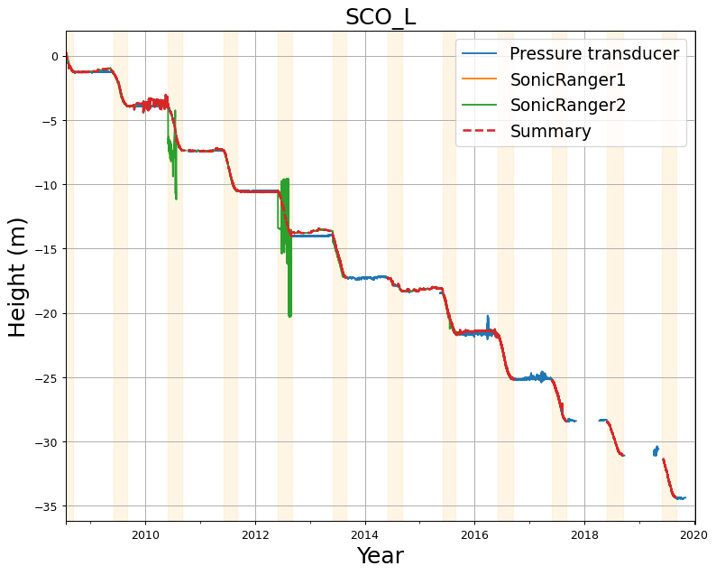
 
# <a id='s16' />SCO_U
## <a id='s16-1' />Removing erroneous data at SCO_U
Flagging data:
|start time|end time|variable|
|-|-|-|
|2009-10-27 00:00:00+00:00|2009-11-26 00:00:00+00:00|DepthPressureTransducer_Cor(m)|
|2011-09-07 00:00:00+00:00|2011-09-27 00:00:00+00:00|DepthPressureTransducer_Cor(m)|
 

 
|start time|end time|variable|
|-|-|-|
|2008-06-07 00:00:00+00:00|2008-09-11 00:00:00+00:00|SnowHeight(m)|
 

 
|start time|end time|variable|
|-|-|-|
|2011-08-25 00:00:00+00:00|2012-08-29 00:00:00+00:00|SurfaceHeight(m)|
|2014-06-29 00:00:00+00:00|2014-10-29 00:00:00+00:00|SurfaceHeight(m)|
|2014-06-29 00:00:00+00:00|2014-10-29 00:00:00+00:00|SurfaceHeight(m)|
 

 
## <a id='s16-2' />Adjusting data at SCO_U
### <a id='s16-2-1' />Adjusting DepthPressureTransducer_Cor(m)
|start time|end time|operation|value|
|-|-|-|-|
|2012-08-29T00:00:00+00:00|nan|add|-1.47|
|2017-08-05T00:00:00+00:00|nan|add|-12.08|
 
.jpeg)
 
### <a id='s16-2-2' />Adjusting SurfaceHeight(m)
|start time|end time|operation|value|
|-|-|-|-|
|2009-08-13T00:00:00+00:00|nan|add|-2.0|
 
.jpeg)
 
## <a id='s16-3' />Summarizing surface height at SCO_U
 
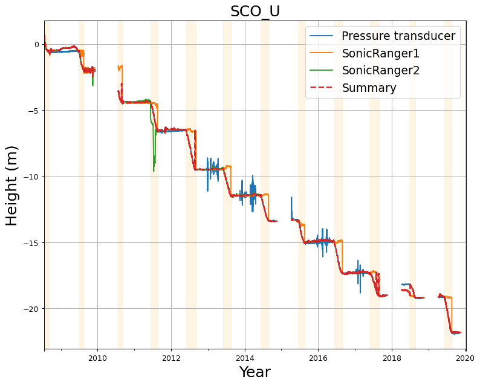
 
# <a id='s17' />TAS_A
## <a id='s17-1' />Removing erroneous data at TAS_A
Flagging data:
|start time|end time|variable|
|-|-|-|
|2017-10-07 00:00:00+00:00|2017-11-26 00:00:00+00:00|DepthPressureTransducer_Cor(m)|
|2017-11-24 00:00:00+00:00|2018-10-14 00:00:00+00:00|DepthPressureTransducer_Cor(m)|
 

 
|start time|end time|variable|
|-|-|-|
|2007-10-07 00:00:00+00:00|2013-09-07 00:00:00+00:00|SnowHeight(m)|
|2017-08-13 00:00:00+00:00|2018-09-01 15:00:00+00:00|SnowHeight(m)|
 

 
## <a id='s17-2' />Adjusting data at TAS_A
### <a id='s17-2-1' />Adjusting DepthPressureTransducer_Cor(m)
|start time|end time|operation|value|
|-|-|-|-|
|2017-11-26T00:00:00+00:00|nan|add|-2.0|
|2019-05-05T00:00:00+00:00|nan|add|-0.28|
 
.jpeg)
 
### <a id='s17-2-2' />Adjusting SurfaceHeight(m)
|start time|end time|operation|value|
|-|-|-|-|
|2016-08-12T00:00:00+00:00|nan|add|-3.0|
 
.jpeg)
 
## <a id='s17-3' />Summarizing surface height at TAS_A
 
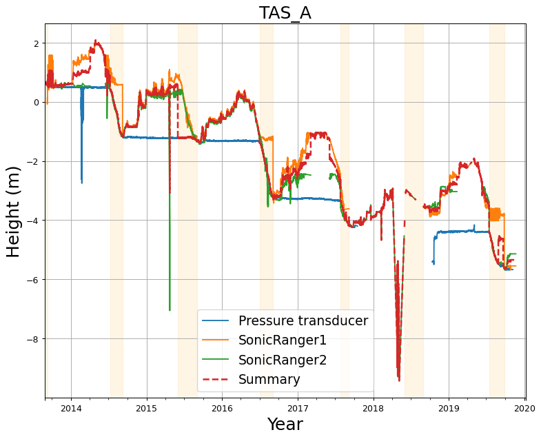
 
# <a id='s18' />TAS_L
## <a id='s18-1' />Removing erroneous data at TAS_L
Flagging data:
|start time|end time|variable|
|-|-|-|
|2007-01-30 00:00:00+00:00|2012-03-20 00:00:00+00:00|DepthPressureTransducer_Cor(m)|
|2012-01-30 00:00:00+00:00|2012-03-10 00:00:00+00:00|DepthPressureTransducer_Cor(m)|
|2012-09-05 00:00:00+00:00|2014-07-30 00:00:00+00:00|DepthPressureTransducer_Cor(m)|
|2016-11-12 00:00:00+00:00|2017-07-27 00:00:00+00:00|DepthPressureTransducer_Cor(m)|
|2015-09-01 00:00:00+00:00|2016-06-15 00:00:00+00:00|DepthPressureTransducer_Cor(m)|
 

 
## <a id='s18-2' />Adjusting data at TAS_L
### <a id='s18-2-1' />Adjusting DepthPressureTransducer_Cor(m)
|start time|end time|operation|value|
|-|-|-|-|
|2014-08-03T00:00:00+00:00|nan|add|-5.0|
|2015-01-03T00:00:00+00:00|nan|add|-3.0|
|2016-01-03T00:00:00+00:00|nan|add|-3.0|
|2017-07-28T00:00:00+00:00|nan|add|-3.36|
|2018-09-29T00:00:00+00:00|nan|add|1.29|
|2019-05-01T00:00:00+00:00|nan|add|-1.135|
 
.jpeg)
 
### <a id='s18-2-2' />Adjusting SurfaceHeight(m)
|start time|end time|operation|value|
|-|-|-|-|
|2011-08-12T00:00:00+00:00|nan|add|-3.0|
|2012-09-05T00:00:00+00:00|nan|add|-2.0|
|2013-08-28T00:00:00+00:00|nan|add|-2.5|
|2014-08-06T00:00:00+00:00|nan|add|-2.3|
 
.jpeg)
 
## <a id='s18-3' />Summarizing surface height at TAS_L
 

 
# <a id='s19' />THU_L
## <a id='s19-1' />Removing erroneous data at THU_L
Flagging data:
## <a id='s19-2' />Adjusting data at THU_L
## <a id='s19-3' />Summarizing surface height at THU_L
 

 
# <a id='s20' />THU_U
## <a id='s20-1' />Removing erroneous data at THU_U
Flagging data:
|start time|end time|variable|
|-|-|-|
|2010-01-30 00:00:00+00:00|2010-09-05 00:00:00+00:00|SnowHeight(m)|
 

 
|start time|end time|variable|
|-|-|-|
|2012-08-16 00:00:00+00:00|2013-08-10 00:00:00+00:00|SurfaceHeight(m)|
|2018-09-13 00:00:00+00:00|2019-05-13 00:00:00+00:00|SurfaceHeight(m)|
 

 
## <a id='s20-2' />Adjusting data at THU_U
## <a id='s20-3' />Summarizing surface height at THU_U
 
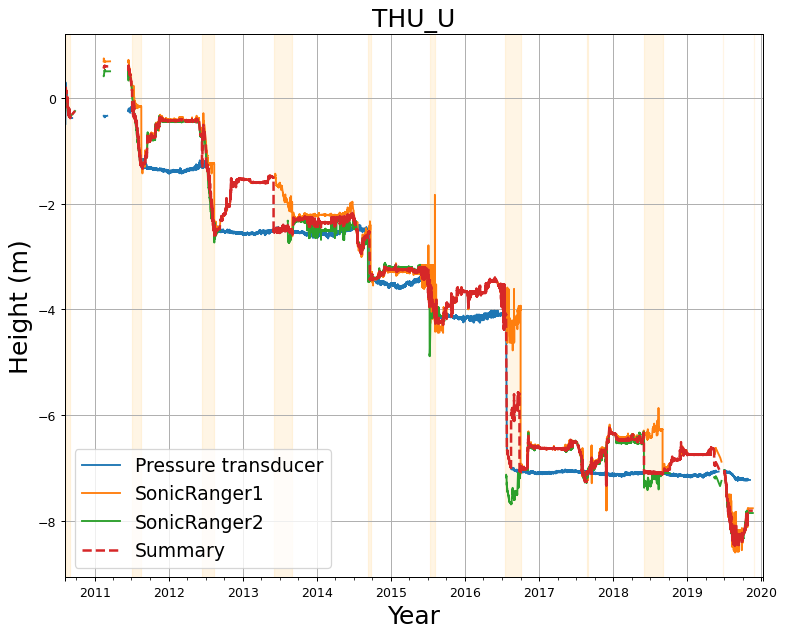
 
# <a id='s21' />UPE_L
## <a id='s21-1' />Removing erroneous data at UPE_L
Flagging data:
|start time|end time|variable|
|-|-|-|
|2008-07-15 00:00:00+00:00|2008-07-18 00:00:00+00:00|DepthPressureTransducer_Cor(m)|
|2011-09-17 00:00:00+00:00|2011-11-16 00:00:00+00:00|DepthPressureTransducer_Cor(m)|
|2012-09-16 00:00:00+00:00|2012-11-05 00:00:00+00:00|DepthPressureTransducer_Cor(m)|
|2013-02-23 00:00:00+00:00|2013-03-02 00:00:00+00:00|DepthPressureTransducer_Cor(m)|
|2015-09-07 00:00:00+00:00|2015-09-17 00:00:00+00:00|DepthPressureTransducer_Cor(m)|
 

 
|start time|end time|variable|
|-|-|-|
|2016-09-07 00:00:00+00:00|2017-01-17 00:00:00+00:00|SurfaceHeight(m)|
 

 
## <a id='s21-2' />Adjusting data at UPE_L
### <a id='s21-2-1' />Adjusting DepthPressureTransducer_Cor(m)
|start time|end time|operation|value|
|-|-|-|-|
|2012-08-12T00:00:00+00:00|nan|add|-0.3|
|2013-08-02T00:00:00+00:00|nan|add|-15.3|
|2015-08-02T00:00:00+00:00|nan|add|-0.32|
 
.jpeg)
 
### <a id='s21-2-2' />Adjusting SurfaceHeight(m)
|start time|end time|operation|value|
|-|-|-|-|
|2012-08-15T00:00:00+00:00|nan|add|-2.0|
|2013-08-03T00:00:00+00:00|nan|add|-1.7|
|2015-08-03T00:00:00+00:00|nan|add|-3.5|
|2016-01-01T00:00:00+00:00|nan|add|1.3|
|2017-01-01T00:00:00+00:00|nan|add|-1.5|
|2017-08-26T00:00:00+00:00|nan|add|-1.3|
 
.jpeg)
 
## <a id='s21-3' />Summarizing surface height at UPE_L
 

 
# <a id='s22' />UPE_U
## <a id='s22-1' />Removing erroneous data at UPE_U
Flagging data:
|start time|end time|variable|
|-|-|-|
|2011-09-02 00:00:00+00:00|2011-09-12 00:00:00+00:00|DepthPressureTransducer_Cor(m)|
|2012-08-27 00:00:00+00:00|2012-11-06 00:00:00+00:00|DepthPressureTransducer_Cor(m)|
|2019-09-07 00:00:00+00:00|2019-09-17 00:00:00+00:00|DepthPressureTransducer_Cor(m)|
 

 
|start time|end time|variable|
|-|-|-|
|2011-06-02 00:00:00+00:00|2011-07-29 00:00:00+00:00|SurfaceHeight(m)|
|2015-06-30 00:00:00+00:00|2015-08-13 00:00:00+00:00|SurfaceHeight(m)|
 

 
## <a id='s22-2' />Adjusting data at UPE_U
### <a id='s22-2-1' />Adjusting DepthPressureTransducer_Cor(m)
|start time|end time|operation|value|
|-|-|-|-|
|2009-08-18T00:00:00+00:00|nan|add|-19.1|
|2013-08-06T00:00:00+00:00|nan|add|-0.3|
|2015-08-04T00:00:00+00:00|nan|add|-5.75|
|2017-08-24T00:00:00+00:00|nan|add|-0.15|
 
.jpeg)
 
### <a id='s22-2-2' />Adjusting SurfaceHeight(m)
|start time|end time|operation|value|
|-|-|-|-|
|2009-08-19T00:00:00+00:00|nan|add|-0.15|
|2011-06-24T00:00:00+00:00|nan|add|-4.5|
|2012-08-12T00:00:00+00:00|nan|add|-3.1|
|2013-08-07T00:00:00+00:00|nan|add|-1.0|
|2014-08-07T00:00:00+00:00|nan|add|-1.2|
|2015-08-13T00:00:00+00:00|nan|add|-3.0|
|2018-08-01T00:00:00+00:00|nan|add|-3.0|
 
.jpeg)
 
## <a id='s22-3' />Summarizing surface height at UPE_U
